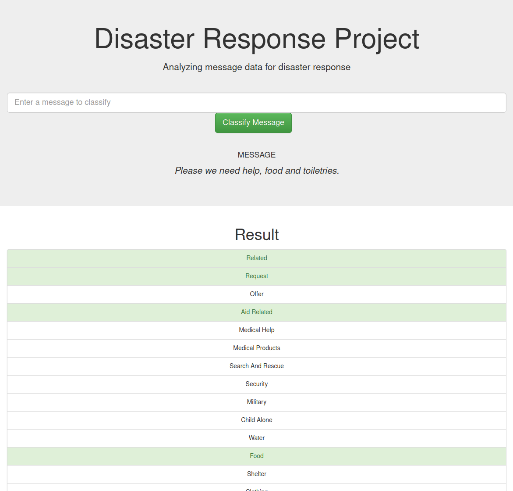

# Udacity Data Scientist Nanodegree

## Disaster Response Pipeline Project

### Description

This project uses two data sets. One is with real messages, that were sent during disaster events, the other is with categories for them. The project analyzes data and builds a machine learning pipeline for an API that classifies disaster messages.  

Link to Flask web app, deployed on Heroku: https://nat-disaster-response.herokuapp.com/ 

#### The project consists of the following components:

1. ETL Pipeline
    - Loads data and merges it
    - Cleans the data
    - Stores clean data in SQLite database

2. ML Pipeline
    - Loads data from the SQLite database
    - Builds a text processing (NLP) and machine learning pipeline
    - Trains and tunes a model using GridSearchCV
    - Evaluates and outputs results on the test set
    - Exports the final model as a pickle file

3. Flask Web App
    - Shows data set visualizations
    - Provides an interface for entering a new message and getting classification results in several categories

### Web app screenshots

### Instructions:
1. Run the following commands in the project's root directory to set up your database and model.

    - To run ETL pipeline that cleans data and stores in database

        `$ python data/process_data.py data/disaster_messages.csv data/disaster_categories.csv data/DisasterResponse.db`

    - To run ML pipeline that trains classifier and saves

        `$ python models/train_classifier.py data/DisasterResponse.db models/classifier.pkl`

2. Run the following command in the app's directory to run your web app.

    `$ python run.py`

3. Go to http://0.0.0.0:3001/

### Project files

    - app
    | - template
    | |- go.html                 # classification result page of web app
    | |- master.html             # main page of web app
    |- run.py                    # Flask file that runs app

    - data
    |- DisasterResponse.db       # database with saved clean data  - output of running process_data.py
    |- disaster_categories.csv   # categories data
    |- disaster_messages.csv     # messages data
    |- process_data.py           # ETL pipeline that cleans data and stores in DisasterResponse.db

    - models
    |- classifier.pkl            # saved model - output of running train_classifier.py
    |- tokenization.py           # module with custom tokenizer
    |- train_classifier.py       # ML pipeline that trains classifier and saves it in classifier.pkl

    - README.md                  # project description
    - requirements.txt           # required libraries

### Acknowledgments

https://stackoverflow.com/questions/38851564/heroku-gunicorn-procfile
https://rebeccabilbro.github.io/module-main-has-no-attribute/
https://csatlas.com/python-import-file-module/
